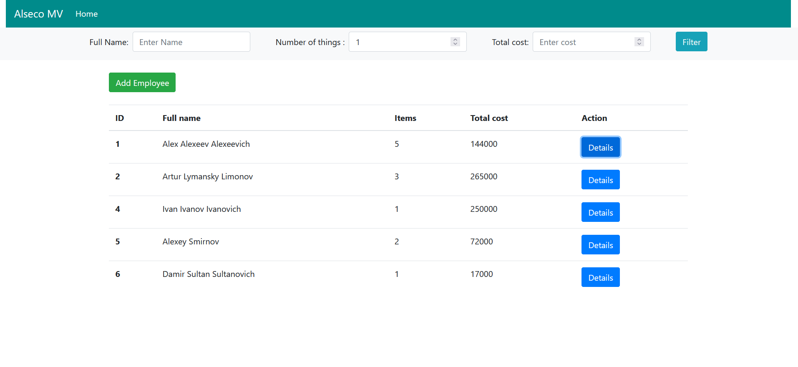

# Alseco-Inventory-Project

This Project uses Spring Boot 2, Spring Data JPA (Hibernate ORM and PostgreSQL), Spring MVC and Thymeleaf

Functionality: All CRUD operations, 2 Entities Employee and Item are binded one-to-many

# Home Page 

# CRUD OPERATION SCREENSHOTS

